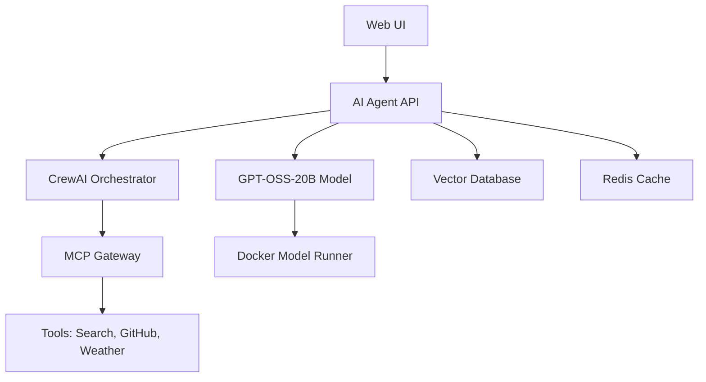

# Build AI Agents with OpenAI's GPT-OSS-20B using Docker Model Runner

🚀 **Complete guide and production-ready examples for building intelligent AI agents using OpenAI's GPT-OSS-20B and Docker's official AI agent patterns.**

[](https://github.com/docker/compose-for-agents)
[](https://github.com/openai/gpt-oss)
[](https://opensource.org/licenses/MIT)

## 🌟 Features

- **🐳 Official Docker Support**: Based on Docker's [compose-for-agents](https://github.com/docker/compose-for-agents) patterns
- **🤖 Multi-Agent Systems**: CrewAI, LangGraph, and custom framework integration
- **🔧 MCP Tool Integration**: Secure tool access via Model Context Protocol
- **📊 Production Ready**: Battle-tested configurations for real workloads
- **☁️ Cloud Scaling**: Seamless Docker Offload for production deployment
- **🔒 Privacy-First**: Your data never leaves your machine
- **💰 Cost-Effective**: Zero API costs with local model execution

## 📋 Prerequisites

- **Docker Desktop 4.40+** (macOS with Apple Silicon) or **Docker Engine on Linux**
- **16GB+ RAM** (32GB recommended for optimal performance)
- **20GB+ free disk space** for model storage
- **Python 3.8+** for development

## 🚀 Quick Start

### 1. Clone and Setup

```bash
git clone https://github.com/ajeetraina/gpt-oss-20b-ai-agent-docker.git
cd gpt-oss-20b-ai-agent-docker

# Copy environment template
cp .env.example .env
# Edit .env with your configuration
```

### 2. Pull AI Models

```bash
# Pull GPT-OSS-20B model (correct command)
docker model pull ai/gpt-oss

# Optional: Pull smaller model for faster responses
docker model pull ai/smollm2
```

### 3. Deploy Full Stack

```bash
# Deploy all services including agents, tools, and databases
docker compose up -d

# Check service status
docker compose ps
```

### 4. Test Your Agent

```bash
# Run simple agent
python simple_agent.py

# Or test advanced multi-agent system
python advanced_agent.py
```

## 📁 Repository Structure

```
├── README.md                    # This file
├── simple_agent.py             # Basic GPT-OSS-20B agent
├── advanced_agent.py           # Multi-agent system with CrewAI patterns
├── docker-compose.yml          # Production-ready Docker setup
├── Dockerfile                  # Optimized container image
├── requirements.txt            # Python dependencies
├── .env.example               # Environment configuration template
├── mcp-config/                # Model Context Protocol configuration
│   └── mcp-config.json       # Tool integration settings
├── crew-ai/                   # CrewAI framework examples
├── examples/                  # Additional usage examples
└── docs/                     # Comprehensive documentation
```

## 🏗️ Architecture Overview

Based on Docker's official [compose-for-agents](https://github.com/docker/compose-for-agents) patterns:



## 🔧 Configuration

### Environment Variables

```bash
# Model Configuration
MODEL_URL=http://host.docker.internal:12434/engines/llama.cpp/v1
MODEL_NAME=ai/gpt-oss
REASONING_LEVEL=medium

# MCP Tools (optional but recommended)
BRAVE_API_KEY=your_brave_search_key
GITHUB_TOKEN=your_github_token
OPENWEATHER_API_KEY=your_weather_key
```

### Multi-Agent Workflow Example

```python
# Create research crew following Docker patterns
crew = create_research_crew()

workflow = [
    {
        "agent": "researcher",
        "task": "Research AI agent development trends"
    },
    {
        "agent": "analyst", 
        "task": "Analyze research findings and identify patterns"
    },
    {
        "agent": "writer",
        "task": "Create comprehensive report with recommendations"
    }
]

results = crew.execute_crew_workflow(workflow)
```

## 📊 Performance Benchmarks

| Metric | GPT-OSS-20B (Local) | OpenAI API | Claude API |
|--------|---------------------|------------|------------|
| Response Time | 50-200ms | 500-2000ms | 800-3000ms |
| Cost per 1M tokens | $0 | $0.50-$15 | $0.25-$75 |
| Privacy | 100% Local | Cloud-based | Cloud-based |
| Offline Operation | ✅ Yes | ❌ No | ❌ No |
| Customization | Full control | Limited | None |

## 🛠️ Framework Support

Based on Docker's official examples, this project supports:

| Framework | Use Case | Example | Status |
|-----------|----------|---------|--------|
| **CrewAI** | Multi-agent collaboration | Marketing strategy, Research teams | ✅ Ready |
| **LangGraph** | Workflow orchestration | SQL agents, Data analysis | ✅ Ready |
| **Custom Agents** | Specialized tasks | Document analysis, Code review | ✅ Ready |
| **Spring AI** | Enterprise Java integration | Business automation | 🔄 Coming Soon |
| **Vercel AI SDK** | Frontend integration | Chat interfaces | 🔄 Coming Soon |

## 🔗 Official Docker Resources

This project follows patterns from Docker's official AI initiatives:

- **📚 [compose-for-agents](https://github.com/docker/compose-for-agents)**: Official Docker AI agent examples
- **🚀 [Docker Model Runner](https://docs.docker.com/ai/model-runner/)**: Local AI model execution
- **☁️ [Docker Offload](https://www.docker.com/products/docker-offload/)**: Cloud scaling for AI workloads
- **🛠️ [MCP Gateway](https://github.com/docker/mcp-gateway)**: Secure tool integration

## 📖 Complete Tutorial

📝 **Read the comprehensive guide**: [How to Build a Simple AI Agent with OpenAI's GPT-OSS-20B using Docker Model Runner](./BLOG_POST.md)

## 🚀 Production Deployment

### Docker Offload for Cloud Scaling

```bash
# Enable Docker Offload
docker offload enable

# Deploy with cloud scaling
docker compose up --offload

# Scale specific services to cloud
docker compose up --offload-service crew-orchestrator
```

### Monitoring and Observability

```bash
# View service logs
docker compose logs -f ai-agent

# Monitor resource usage
docker stats

# Health checks
curl http://localhost:8000/health
```

## 🤝 Contributing

We welcome contributions! This project follows Docker's official patterns and welcomes:

- 🐛 Bug fixes and improvements
- 📝 Documentation updates
- 🔧 New agent examples
- 🛠️ Tool integrations
- 📊 Performance optimizations

## 📄 License

This project is licensed under the MIT License - see the [LICENSE](LICENSE) file for details.

## 🌟 Acknowledgments

- **OpenAI** for releasing GPT-OSS-20B under Apache 2.0 license
- **Docker** for official AI agent support and patterns
- **Docker compose-for-agents** community for battle-tested examples
- **MCP Protocol** for standardized tool integration

## ⭐ Star History

If this project helped you build amazing AI agents, please star it! ⭐

[](https://star-history.com/#ajeetraina/gpt-oss-20b-ai-agent-docker&Date)


*Following official Docker patterns from [compose-for-agents](https://github.com/docker/compose-for-agents)*
